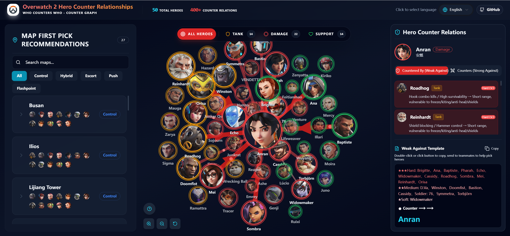

# Overwatch 2 Hero Counter Relationships

[**简体中文**](README.zh-CN.md) | English

An interactive visualization application built with React + TypeScript + Vite to display hero counter relationships in Overwatch 2.

## Live Demo

**[View Deployed GitHub Pages](https://cyrus123456.github.io/Overwatch-2-Hero-Counters/)**

You can access the link above directly to experience the full hero counter visualization without local installation!

## 🎮 Features

- **Interactive Force-Directed Graph**: Dynamic visualization of hero counter relationships using D3.js
- **Real-time Search**: Quickly find and filter heroes
- **Complete Hero Library**: All Overwatch 2 heroes with role classifications (Tank, Damage, Support)
- **Counter Relationship Display**: Clear visualization of hero counters and strength levels
- **Map Data**: Information about all maps in the game
- **Multi-language Support**: Built-in internationalization framework
- **Dark/Light Theme**: Modern UI design with theme switching

## 🚀 Quick Start

### Requirements

- Node.js >= 18
- npm, yarn, or pnpm

### Install Dependencies

```bash
npm install
# or
yarn install
# or
pnpm install
```

### Development Mode

```bash
npm run dev
```

The app will start at `http://localhost:5173` with Hot Module Replacement (HMR) support.

### Production Build

```bash
npm run build
```

### Preview Build

```bash
npm run preview
```

## 📦 Project Structure

```
src/
├── components/          # React components
│   ├── ForceGraph.tsx   # Force-directed graph visualization
│   └── ui/              # UI components (Radix UI based)
├── data/                # Data definitions
│   ├── heroData.ts      # Hero data and image configuration
│   ├── counterReasons.ts # Counter reason descriptions
│   └── mapData.ts       # Map data
├── hooks/               # Custom React Hooks
├── i18n/                # Internationalization
└── lib/                 # Utility libraries
```

## 🛠️ Tech Stack

- **Framework**: React 19 + TypeScript
- **Build Tool**: Vite
- **Data Visualization**: D3.js 7
- **UI Components**: Radix UI + TailwindCSS
- **Theme Switching**: next-themes
- **Internationalization**: i18n support

## 💡 User Guide

### Viewing Hero Counter Relationships

1. After launching the app, an interactive force-directed graph will be displayed
2. Each node represents an Overwatch hero
3. Lines between nodes indicate counter relationships (from counterer to countee)
4. Different hero roles are distinguished by different colors

### Interactive Operations

- **Click Hero**: Focus on their counter network & scale up the icon
- **Drag Icon**: Hold and move to reposition manually
- **Scroll Zoom**: Use mouse wheel to zoom in/out
- **Hover Focus**: Mouse over icon to highlight and focus
- **Pan Board**: Click and drag empty space to move the graph

### Counter Strength Levels

- ★★★ Hard Counter (Direct Nemesis)
- ★★ Strong Counter (Solid Advantage)
- ★ Soft Counter (Skill Matchup)

## 🔗 Resources

- [Overwatch Official Website](https://overwatch.blizzard.com/)
- [React Documentation](https://react.dev)
- [D3.js Documentation](https://d3js.org)
- [Vite Documentation](https://vitejs.dev)

## 📝 License

This project is for educational and reference purposes only.

## 👥 Contributing

Issues and Pull Requests are welcome!

---

**Note**: Overwatch and its related resources are trademarks and intellectual property of Blizzard Entertainment.
