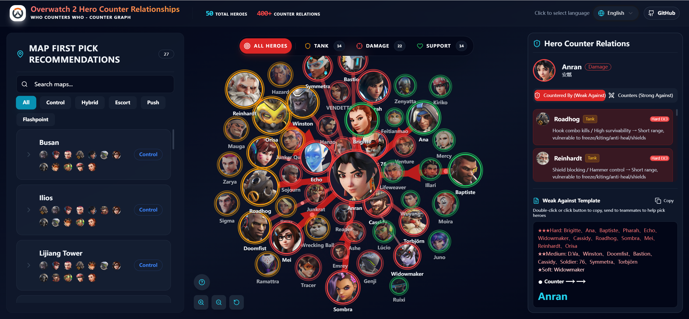

# Overwatch 2 Hero Counter Relationships

[**简体中文**](README.zh-CN.md) | English

An interactive visualization application built with React + TypeScript + Vite to display hero counter relationships and synergies in Overwatch 2.

## Live Demo

[**View Deployed GitHub Pages**](https://cyrus123456.github.io/Overwatch-2-Hero-Counters/) | [**Cloudflare Workers & Pages**](https://overwatch-herocounters.b8c72dzp5t.workers.dev/)

You can access the links above directly to experience the full hero counter visualization without local installation!

## Features

- **Interactive Force-Directed Graph**: Dynamic visualization using D3.js
- **Synergy Relationships**: Explore hero synergies and team compositions
- **Real-time Search**: Quickly find and filter heroes
- **Complete Hero Library**: All OW2 heroes with role classifications (Tank, Damage, Support)
- **Counter Relationship Display**: Clear visualization of counters and strength levels
- **Map Data**: Information about all maps in the game
- **Multi-language Support**: Built-in internationalization (Chinese/English)
- **Dark/Light Theme**: Modern UI with theme switching
- **Command Palette**: Quick actions via Cmd+K

## Quick Start

### Requirements

- Node.js >= 18
- npm, yarn, or pnpm

### Install Dependencies

```bash
npm install
# or
yarn install
# or
pnpm install
```

### Development Mode

```bash
npm run dev
```

The app starts at `http://localhost:5173` with HMR. Use `--host` for mobile access.

### Production Build

```bash
npm run build
```

### Preview

```bash
npm run preview
```

### Deploy to GitHub Pages

```bash
npm run deploy
# or
npm run build:deploy
```

## Project Structure

```
src/
├── components/          # React components
│   ├── ForceGraph.tsx  # D3 force-directed graph
│   └── ui/             # Radix UI based components
├── data/                # Data definitions
│   ├── heroData.ts
│   ├── counterReasons.ts
│   ├── counterRelations.ts
│   ├── synergyReasons.ts
│   ├── synergyRelations.ts
│   └── mapData.ts
├── hooks/               # Custom React hooks
├── i18n/                # Internationalization
└── lib/                 # Utilities
```

## Tech Stack

- **Framework**: React 19 + TypeScript
- **Build**: Vite 7
- **Visualization**: D3.js 7
- **UI**: Radix UI + TailwindCSS
- **Icons**: Lucide React
- **Forms**: react-hook-form + Zod
- **Theme**: next-themes
- **i18n**: Built-in support

## User Guide

### Viewing Relationships

1. Launch the app to see an interactive force-directed graph
2. Each node represents an Overwatch hero
3. Lines show counter relationships (from counterer to countee)
4. Different roles use different colors

### Interactions

- **Click Hero**: Focus on their counter network, scale up icon
- **Drag**: Move heroes to reposition
- **Scroll**: Zoom in/out
- **Hover**: Highlight and focus
- **Pan**: Click and drag empty space

### Strength Levels

**Counter:**
- ★★★ Hard Counter
- ★★ Strong Counter
- ★ Soft Counter

**Synergy:**
- ★★★ Strong Synergy
- ★★ Good Synergy
- ★ Basic Synergy

## Resources

- [Overwatch Official](https://overwatch.blizzard.com/)
- [React](https://react.dev)
- [D3.js](https://d3js.org)
- [Vite](https://vitejs.dev)

## License

For educational purposes only.

## Contributing

Issues and Pull Requests welcome!

---

**Note**: Overwatch and related resources are trademarks of Blizzard Entertainment.
