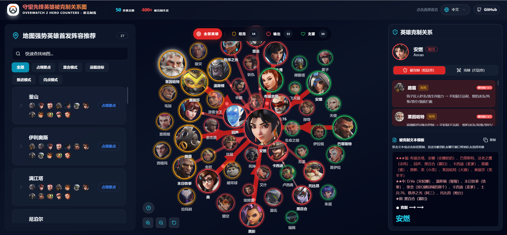

# 守望先锋英雄克制关系可视化

[English](README.md) | 简体中文

一个基于 React + TypeScript + Vite 的交互式可视化应用，用于展示《守望先锋 2》中英雄之间的克制关系与协同搭配。

## 在线演示

[**点击查看已部署的 GitHub Pages**](https://cyrus123456.github.io/Overwatch-2-Hero-Counters/) | [**Cloudflare Workers & Pages**](https://overwatch-herocounters.b8c72dzp5t.workers.dev/)

直接访问上方链接即可体验完整功能！

## 功能特性

- **交互式力导向图**：使用 D3.js 实现动态可视化
- **协同关系**：探索英雄协同和团队阵容搭配
- **实时搜索**：快速查找和筛选英雄
- **完整英雄库**：包含所有守望先锋 2 英雄及其职业分类
- **克制关系展示**：清晰显示克制关系及强度等级
- **地图数据**：包含游戏中所有地图信息
- **多语言支持**：内置国际化（中文/英文）
- **深色/浅色主题**：现代化 UI 配合主题切换
- **命令面板**：通过 Ctrl+K 快速执行操作

## 快速开始

### 环境要求

- Node.js >= 18
- npm / yarn / pnpm

### 安装依赖

```bash
npm install
# 或
yarn install
# 或
pnpm install
```

### 开发模式

```bash
npm run dev
```

应用将在 `http://localhost:5173` 启动，支持热重载 (HMR)。使用 `--host` 可从移动设备访问。

### 生产构建

```bash
npm run build
```

### 预览

```bash
npm run preview
```

### 部署到 GitHub Pages

```bash
npm run deploy
# 或
npm run build:deploy
```

## 项目结构

```
src/
├── components/          # React 组件
│   ├── ForceGraph.tsx  # D3 力导向图
│   └── ui/             # Radix UI 组件
├── data/                # 数据定义
│   ├── heroData.ts
│   ├── counterReasons.ts
│   ├── counterRelations.ts
│   ├── synergyReasons.ts
│   ├── synergyRelations.ts
│   └── mapData.ts
├── hooks/               # 自定义 hooks
├── i18n/                # 国际化
└── lib/                 # 工具函数
```

## 技术栈

- **框架**：React 19 + TypeScript
- **构建**：Vite 7
- **可视化**：D3.js 7
- **UI**：Radix UI + TailwindCSS
- **图标**：Lucide React
- **表单**：react-hook-form + Zod
- **主题**：next-themes
- **国际化**：内置支持

## 使用指南

### 查看关系

1. 启动应用后显示交互式力导向图
2. 每个节点代表一个守望先锋英雄
3. 连线表示克制关系（从克制方指向被克制方）
4. 不同角色用不同颜色区分

### 交互操作

- **点击英雄**：展示其专属网络并放大
- **拖拽**：手动调整位置
- **滚轮**：放大/缩小
- **悬停**：高亮聚焦
- **平移**：拖拽空白处移动画布

### 强度说明

**克制：**
- ★★★ 绝对克制
- ★★ 明显克制
- ★ 轻微克制

**协同：**
- ★★★ 强力协同
- ★★ 良好协同
- ★ 基础协同

## 相关资源

- [守望先锋官网](https://overwatch.blizzard.com/)
- [React](https://react.dev)
- [D3.js](https://d3js.org)
- [Vite](https://vitejs.dev)

## 许可证

仅供学习参考使用。

## 贡献

欢迎提交 Issue 和 Pull Request！

---

**注意**：《守望先锋》相关资源为暴雪娱乐商标和知识产权。
